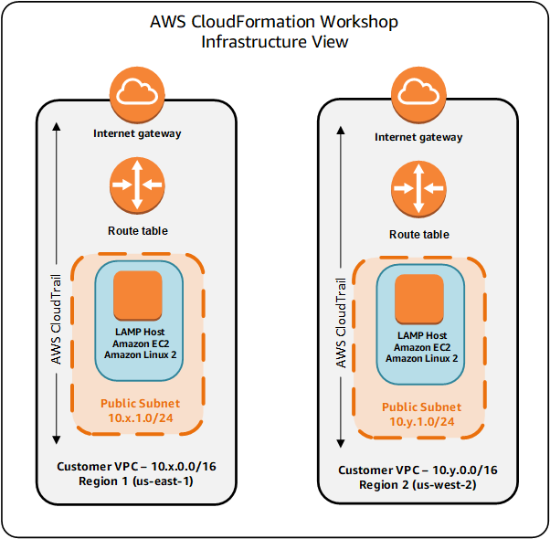
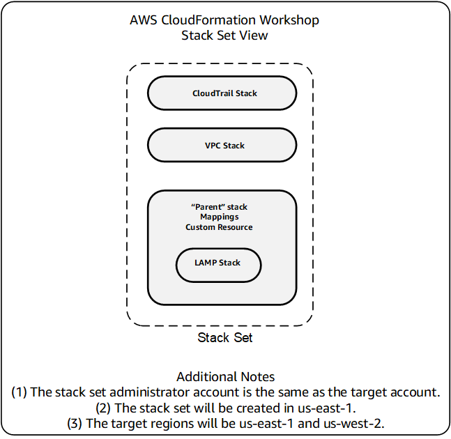
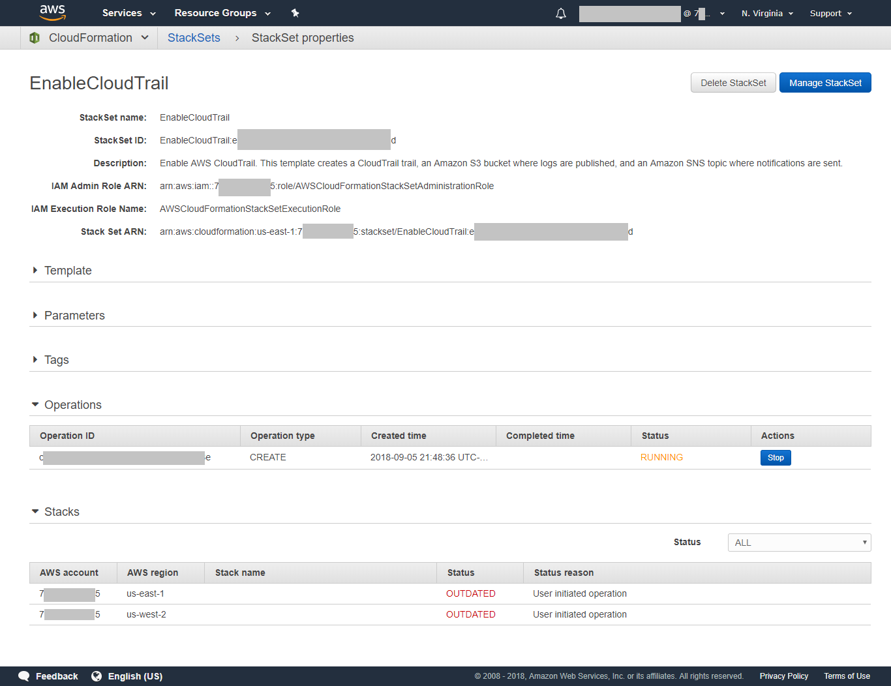
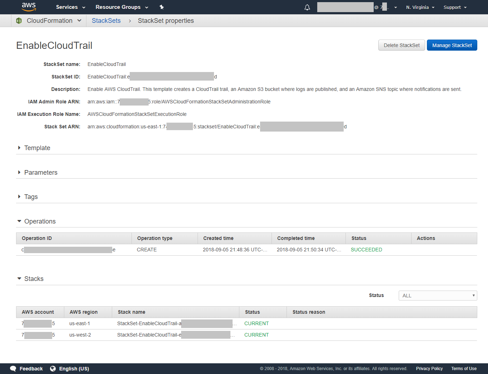
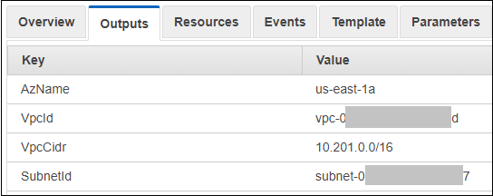
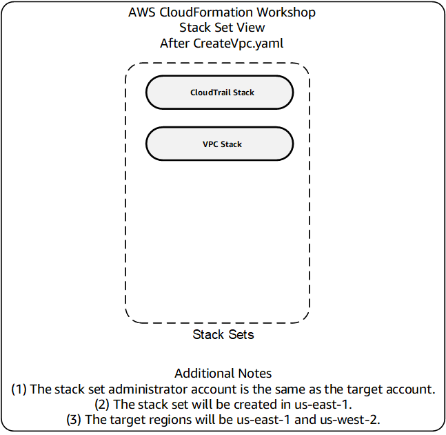
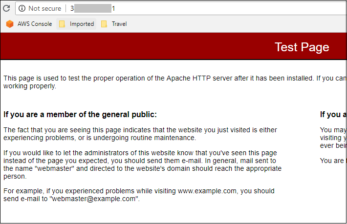

<!--                                                                                       -->
<!-- Copyright 2018 Amazon.com, Inc. or its affiliates. All Rights Reserved.               -->
<!--                                                                                       -->
<!-- Permission is hereby granted, free of charge, to any person obtaining a copy of this  -->
<!-- software and associated documentation files (the "Software"), to deal in the Software -->
<!-- without restriction, including without limitation the rights to use, copy, modify,    -->
<!-- merge, publish, distribute, sublicense, and/or sell copies of the Software, and to    -->
<!-- permit persons to whom the Software is furnished to do so.                            -->
<!--                                                                                       -->
<!-- THE SOFTWARE IS PROVIDED "AS IS", WITHOUT WARRANTY OF ANY KIND, EXPRESS OR IMPLIED,   -->
<!-- INCLUDING BUT NOT LIMITED TO THE WARRANTIES OF MERCHANTABILITY, FITNESS FOR A         -->
<!-- PARTICULAR PURPOSE AND NONINFRINGEMENT. IN NO EVENT SHALL THE AUTHORS OR COPYRIGHT    -->
<!-- HOLDERS BE LIABLE FOR ANY CLAIM, DAMAGES OR OTHER LIABILITY, WHETHER IN AN ACTION     -->
<!-- OF CONTRACT, TORT OR OTHERWISE, ARISING FROM, OUT OF OR IN CONNECTION WITH THE        -->
<!-- SOFTWARE OR THE USE OR OTHER DEALINGS IN THE SOFTWARE.                                -->
<!--                                                                                       -->
# ___AWS CloudFormation Workshops___

# Workshop 1

### Introduction

In this workshop, you will learn how to build a dual-region environment using AWS CloudFormation StackSets.
Each region will contain an Amazon VPC and an Amazon Linux 2 instance running a LAMP (Linux/Apache/MariaDB/PHP) stack.

### Architecture Overview

Here's an infrastructure diagram of what you will build.



Here's a diagram of the same architecture from a CloudFormation StackSet perspective:



### Prerequisites, Assumptions, and Caveats

In order to complete this workshop you'll need the following:
<br />
* an AWS Account with administrator access to services used in the module including AWS CloudFormation, Amazon CloudWatch, AWS Lambda, AWS Systems Manager and others as needed and
* familiarity with the above services and the AWS console.

You will be working with templates written in YAML.
YAML takes indentation into account when parsing templates.
Some text editors handle tab characters differently.
For this reason, you should consider using only spaces, not tabs while entering lines.
You should also consider disabling any automatic formatting or indentation provided by your text editor.

### Charges

You will incur charges for the services used in these modules.  The pricing for each service is available on that service's pricing page.

### 1. Choose two regions

You need to choose two regions, one of which will be the "administrative" region in which the CloudFormation *stackset* is built.
Even though the individual stacks will be built in both regions, the *stackset* definition resides in what is called the "administrative" region.
The "target" regions will be the two regions across which you will deploy the StackSet.
In these instructions, the administrative region is us-east-1 (Northern Virginia) while the target regions are both us-east-1 and us-west-2 (Oregon).

You can choose from any of the following regions:

us-east-1, us-east-2, us-west-1, us-west-2, 
eu-central-1, eu-west-1, eu-west-2, eu-west-3

**Tip:** The AWS region name is always listed in the upper-right corner of the AWS Management Console, in the navigation bar.

Make a note of your two regions, perhaps copying them into your workstation's clipboard as you will need to move between them in this workshop.
For more information about regions, see: [AWS Regions and Endpoints](http://docs.aws.amazon.com/general/latest/gr/rande.html).

### 2. Locate your AWS account ID

You will need to supply your 12-digit AWS account ID in some of the instructions that follow.
To locate your account ID, sign into the AWS console and click on **Support** on right of the top menu.
The ID is located after "Account number" on the support page.
Copy this ID to a scratch file on your desktop so you can have it available later as needed.

### 3. Set up IAM roles for AWS CloudFormation StackSets

AWS Cloudformation StackSets requires two IAM roles in order to install stacks across regions:

- AWSCloudFormationStackSetAdministrationRole
- AWSCloudFormationStackSetExecutionRole

You will create these roles, if they do not already exist, by deploying two CloudFomration templates provided by AWS.
The instructions in sections 3.1 and 3.2 are the standard way of deploying a template from an S3 template URL.


- __3.1.__ Go to the IAM Console, select Roles and see if the role named AWSCloudFormationStackSetAdministrationRole already exists.  If the role exists, skip to section 3.2.  If the role does *not* exist, then do the following:

- __3.1.1__ Go the CloudFormation console.

- __3.1.2__ Set your region to the *administrative* region (us-east-1 in this example).

- __3.1.3__ Click **Create Stack**.

- __3.1.4__ Click **Specify an Amazon S3 template URL** and specify the URL https://s3.amazonaws.com/cloudformation-stackset-sample-templates-us-east-1/AWSCloudFormationStackSetAdministrationRole.yml and click **Next**.  (Alternatively, you can also download the S3 template to a file on your workstation and then click **Choose File**.)

- __3.1.5__ Enter **StacksetAdministrationRole** for the name of the stack and click **Next**.

- __3.1.6__ Click **Next** again.

- __3.1.7__ Check the **Acknowledge** box to acknowledge that you are creating IAM resources and click **Create**.
CloudFormation will begin to create the role.
Refresh the screen to update the status.
Wait until the status changes to CREATE_COMPLETE.
If the stack rolls back, it likely means that the AWSCloudFormationStackSetAdministrationRole role already exists.

<br />

- __3.2.__ Go to the IAM Console, select Roles and see if the role named AWSCloudFormationStackSetExecutionRole already exists.
If the role *exists* and your AWS account ID has been configured into it, then proceed to section 4. If the role does *not* exist, then do the following:

- __3.2.1__ Go the CloudFormation console.

- __3.2.2__ Set your region to the *administrative* region (us-east-1 in this example).

- __3.2.3__ Click **Create Stack**.

- __3.2.4__ Click **Specify an Amazon S3 template URL** and specify the URL https://s3.amazonaws.com/cloudformation-stackset-sample-templates-us-east-1/AWSCloudFormationStackSetExecutionRole.yml.
For the field AdministratorAccountId, enter your AWS account ID that you saved from section 2 and click **Next**.

- __3.2.5__ Enter **StacksetExecutionRole** for the name of the stack and click **Next**.

- __3.2.6__ Click **Next** again.

- __3.2.7__ Check the **Acknowledge** box to acknowledge that you are creating IAM resources and click **Create**.
CloudFormation will begin to create the role.
Refresh the screen to update the status.
Wait until the status changes to CREATE_COMPLETE.
If the stack rolls back, it likely means that the AWSCloudFormationStackSetExecutionRole role already exists.

| **Important Security Note** | 
| ---------- | 
| |
|**_The default permissions for the AWSCloudFormationStackSetExecutionRole grants administrator access for CloudFormation StackSets to provision all AWS services. After you use the template to create a target account execution role, you should consider adjusting the permissions in the policy statement to the types of resources that you are creating by using StackSets._**

### 4. Create the EnableCloudTrail StackSet

Now that you have created the two IAM roles, you will now create your first stackset.
A StackSet represents a CloudFormation template that has been deployed across one or more accounts in one or more regions.
You will be creating a StackSet in the two target regions of your AWS account.
When you create a StackSet, you can choose from the sample templates provided by AWS or you can upload your own template into Amazon S3.
Your first StackSet will be a sample template provided by AWS.
This will help you to learn the process for deploying a StackSet and also determine if the two IAM roles have been properly configured.

- __4.1__ Go to the CloudFormation console.  Make sure you are in the administrative region (us-east-1 in this example) and select StackSets from the drop-down menu and click **Create StackSet**.

- __4.2__ Choose **Select a sample template from the following templates**.

- __4.3__ Click on **Enable AWS CloudTrail** and then click **Next**.

- __4.4__ On the *Specify Details* page, enter **EnableCloudTrail** for the stack name, accept all the default values in the other fields.
Notice that you are only prompted for the parameters once even though you will be deploying the StackSet in two regions.
Click **Next**.

- __4.5__ On the *Set deployment options* page, choose **Deploy stacks in accounts** and enter your AWS account ID in the field.

- __4.6__ Under *Available regions* select both target regions (us-east-1 and us-west-2 in this example) and click **Add** to move the regions over to the *Deployment order* column.
The order itself is not important.
Click **Next**.

- __4.7__ On the *Options* page, click **Next**.

- __4.8__ On the *Revew* page, click **Create**.

  CloudFormation will begin to create the StackSet by delivering the template to each region and building the individual CloudFormation stack in each region.
It will take several minutes to deploy the StackSet.
Initially, there is an operation in the *RUNNING* state and the two stacks are in the *OUTDATED* state, meaning that they need to be deployed as shown below.



After the StackSet build has been completed, the operation state will change to *SUCCEEDED* and the individual stacks will be in a *CURRENT* state as shown below.



You can also go to the CloudFormation console in each of the target regions to verify the presence of the individual stack.

### 5. Create the CreateVpc StackSet

Now that you have learned how to deploy a CloudFormation template as well as a CloudFormation StackSet, you are going to build a template that will eventually be used to create a StackSet that creates an Amazon VPC in each target region.
You will first develop the template and deploy it into the administrative region, then refine the template, and then deploy the template as a StackSet.

- __5.1__ Download the CreateVpc.yaml template to your workstation by right clicking on [this link](https://github.com/aws-samples/aws-cloudformation-workshops/raw/master/workshop_1/CreateVpc.yaml), and select 'Save as' (or the equivalent in your browser).  **NOTE: Make sure you change the file extension to .yaml if your browser does not do this for you**.

- __5.2__ Go to the CloudFormation console and select the administrative region (us-east-1 in this example).

- __5.3__ Deploy the template as a *stack* (not a *StackSet*) in the administrative region (us-east-1 in this example).
Again, you are not deploying this across both regions, *only the administrative region*.
When prompted, enter *CreateVpc* as the stack name and select any Availability Zone you wish.
The Availability Zone will be used to create the public subnet in the VPC.
It will take several minutes to deploy the stack.

- __5.4__ Notice that you were prompted for an Availability Zone in the administrative region (us-east-1).
Later on when you deploy this a StackSet across both regions, you will still only be prompted once for the Availability Zone.

  Question: What will happen when you try build the VPC subnet in both target regions using the same Availability Zone?
To be more specific, what would happen if you tried to provision a subnet in the us-east-1a Availability Zone within a VPC in the us-west-2 region?

  By default, when you build a StackSet you only provide one set of parameters that is used across all stacks within the StackSet.
While you can override this and provide different parameters within each region, it's best to not put this in the hands of the user (Why?).
A better approach is to have the logic that selects the Availability Zone for the subnet be a part of the template itself.
This would allow you to use the exact same template across both target regions and have CloudFormation automatically provision the submet in an Availability Zone within each region.

- __5.5__ Go to the CloudFormation console in the administrative region (us-east-1 in this example).  Select the CreateVpc stack, click *Actions* and select *Delete Stack* to delete the CreateVpc stack.

- __5.6__ Open the CreateVpc.yaml file in a text editor.

- __5.7__ Delete the following lines:

```
Parameters:
  AzName:
    Type: AWS::EC2::AvailabilityZone::Name
    Description: Subnet Availability Zone
```

- __5.8__ Replace this line:

```
      AvailabilityZone: !Ref AzName
```

  with these lines:
  
```
      AvailabilityZone: !Select
        - 0
        - !GetAZs ""
```
  
  Make sure the AvailabilityZone line is indented to the same level as the CidrBlock line below it.
The two lines below AvailabilityZone are each indented by two additional spaces.
Here's what this change accomplishes.  Rather than prompting the user for an Availability Zone, the template automatically selects an Availability Zone using the [Select](https://docs.aws.amazon.com/AWSCloudFormation/latest/UserGuide/intrinsic-function-reference-select.html) and [GetAZs](https://docs.aws.amazon.com/AWSCloudFormation/latest/UserGuide/intrinsic-function-reference-getavailabilityzones.html) intrinsic functions offered by AWS CloudFormation.

After you have done this, the PublicSubnet resource should look like this:

```
  PublicSubnet:
    Type: AWS::EC2::Subnet
    Properties:
      AvailabilityZone: !Select
        - 0
        - !GetAZs ""
      CidrBlock: 10.200.11.0/24
      MapPublicIpOnLaunch: 'true'
      VpcId: !Ref Vpc
```

 Also, replace these lines in the Outputs section:
 
```
  SubnetId:
    Description: Subnet Id
    Value: !Ref PublicSubnet

  VpcId:
    Description: Vpc Id
    Value: !GetAtt PublicSubnet.VpcId

  AzName:
    Description: Subnet Availability Zone
    Value: !GetAtt PublicSubnet.AvailabilityZone
```

with these lines:

```
  SubnetId:
    Description: Subnet Id
    Value: !Ref PublicSubnet
    Export:
      Name: SubnetId

  VpcId:
    Description: Vpc Id
    Value: !GetAtt PublicSubnet.VpcId
    Export:
      Name: VpcId

  AzName:
    Description: Subnet Availability Zone
    Value: !GetAtt PublicSubnet.AvailabilityZone
    Export:
      Name: AzName
```

  Adding the Export attribute causes CloudFormation to export (publish) values that can be imported (consumed) by other CloudFormation stacks.
This is a common pattern and allows a common stack to be shared by other stacks.
You will make use of this feature later in this workshop.
Many CloudFormation resource types support the use of the [Ref](https://docs.aws.amazon.com/AWSCloudFormation/latest/UserGuide/intrinsic-function-reference-ref.html) and [GetAtt](https://docs.aws.amazon.com/AWSCloudFormation/latest/UserGuide/intrinsic-function-reference-getatt.html) intrinsics to provide additional information.
For example, see the [Subnet resource page](https://docs.aws.amazon.com/AWSCloudFormation/latest/UserGuide/aws-resource-ec2-subnet.html) for how to use Ref and GetAtt to retrive information about subnet resources.
  
- __5.9__ Save the updates to the file.
  
- __5.10__ Deploy the updated CreateVpc.yaml file as a stack (not a StackSet) within the administrative region (us-east-1).
Use *CreateVpc* for the name of the stack.
Note that you are no longer prompted for the Availability Zone.
If you receive errors, make any adjustments needed and try deploying the stack again until you receive no errors.
Look at the Outputs of the stack.
Note that CloudFormation automatically chose the availability zone of the subnet.
  
- __5.11__ Delete the CreateVpc stack.  Wait for the deletion to complete.

- __5.12__ Just as you thought you were done, you received the following message from a colleague who is responsible for the architecture of your company's network:

```
Attention Cloud Services Team!  We may need to establish peering relationships between Amazon VPCs.
Please make sure that each VPC has a unique CIDR block in the 10.0.0.0/8 space.
```

  You look inside the CreateVpc.yaml file and notice these two sets of lines:
  
```
  Vpc:
    Type: AWS::EC2::VPC
    Properties:
      CidrBlock: 10.200.0.0/16
      EnableDnsHostnames: 'true'

  PublicSubnet:
    Type: AWS::EC2::Subnet
    Properties:
      AvailabilityZone: !Ref AzName
      CidrBlock: 10.200.11.0/24
      MapPublicIpOnLaunch: 'true'
      VpcId: !Ref Vpc
```

  In short, the VPCs in both target regions are being built with the *same* CIDR address block (10.200.0.0/16).
You need to some up with a way to use *different* CIDR blocks for each region in which the stack is deployed, preferably in an automatic manner.
AWS CloudFormation offers a way to do this with *mappings*.

- __5.13__ Download the Mappings.yaml template to your workstation by right clicking on [this link](https://github.com/aws-samples/aws-cloudformation-workshops/raw/master/workshop_1/Mappings.yaml), and select 'Save as' (or the equivalent in your browser). **NOTE: Make sure you change the file extension to .yaml if your browser does not do this for you**.

- __5.14__ Insert the contents of the Mappings.yaml file into the CreateVpc.yaml file above the *Resources:* line.
The rows of Mappings.yaml create a map named *RegionMap* that CloudFormation can use to look up attributes associated with a region.
The attributes for each region are VpcCidr and SubnetCidr which are the CIDR address blocks to associate with the VPC and public subnet for each region.

- __5.15__ You now need to tell CloudFormation to use the values in the RegionMap mapping.
*Replace* the lines shown in section 5.12 with these lines:

```
  Vpc:
    Type: AWS::EC2::VPC
    Properties:
      CidrBlock: !FindInMap [ RegionMap, !Ref "AWS::Region", VpcCidr ]
      EnableDnsHostnames: 'true'

  PublicSubnet:
    Type: AWS::EC2::Subnet
    Properties:
      AvailabilityZone: !Select
        - 0
        - !GetAZs ""
      CidrBlock: !FindInMap [ RegionMap, !Ref "AWS::Region", SubnetCidr ]
      MapPublicIpOnLaunch: 'true'
      VpcId: !Ref Vpc
```

  Notice the use of the [FindInMap](https://docs.aws.amazon.com/AWSCloudFormation/latest/UserGuide/intrinsic-function-reference-findinmap.html) function to look up the VpcCidr and SubnetCidr values based on the current region which is provided by the [AWS::Region pseudo-parameter](https://docs.aws.amazon.com/AWSCloudFormation/latest/UserGuide/pseudo-parameter-reference.html).
  
- __5.16__ Save the updated CreateVpc.yaml file.

- __5.17__ Deploy the updated CreateVpc.yaml file as a stack (not a StackSet) within the administrative region (us-east-1).
Use *CreateVpc* for the name of the stack.
After the stack has been deployed examine the outputs for the stack.
You will see that CloudFormation has by itself chosen an Availability Zone within each region for the subnet as well as a VPC CIDR block that is specific to the region as shown below.



If you receive errors, make any adjustments needed and try deploying the stack again until you receive no errors.
  
- __5.18__ Delete the CreateVpc stack.  Wait for the deletion to complete.

- __5.19__ Deploy the createvpc.yaml as a *StackSet* from the administrative region (us-east-1) into both target regions (us-east-1 and us-west-2).
Note that you will select the *Upload a template to Amazon S3* option. Use *CreateVpc* as the StackSet name.

- __5.20__ After the StackSet deployment has been completed, go to the CloudFormation console for each target region (us-east-1 and us-west-2) and select the stack.
Note that the stack name of the individual stack created by the stackset will begin with *StackSet-* and be followed by the name you provided.
look at the Output for each target stack.
You will again see that CloudFormation has by itself chosen an Availability Zone within each region for the subnet as well as a VPC CIDR block that is specific to the region.

- __5.21__ Here's an infrastructure diagram of what you have built thus far:


Here's a diagram of what you have built thus far from a CloudFormation StackSet perspective:



### 6. Create the LAMP StackSet

- __6.1__ Download the Lamp.yaml template to your workstation by right clicking on [this link](https://github.com/aws-samples/aws-cloudformation-workshops/raw/master/workshop_1/Lamp.yaml), and select 'Save as' (or the equivalent in your browser). **NOTE: Make sure you change the file extension to .yaml if your browser does not do this for you**.
This template creates a LAMP (Linux, Apache, MariaDB, PHP) stack.
This workshop will highlight some features of this stack.
You are encouraged to study the stack to learn more about the details not covered in this workshop.

- __6.2__ In the *Parameters* section, notice how the template prompts you for the AzName, VpcId, and SubnetId.
This seems unnecessary because the CreateVpc.yaml template had these values in the *Outputs* section and, furthermore, these were *exported* by CreateVpc.yaml.
You have read that you can *import* values from another stack through [Cross-Stack References](https://docs.aws.amazon.com/AWSCloudFormation/latest/UserGuide/walkthrough-crossstackref.html).
Just when you were getting ready to modify the template, you receive the following message from the Cloud Standards Team:

```
Attention Cloud Services Team!  The Standards Team has decided to adopt the Lamp.yaml file
in its current form for our projects.  You may copy this file as often as you need to but
you cannot make changes to it.
```

You try to explain to the Standards Team that modifying this template will simplify matters but they want to keep the environment stable and not introduce any changes to the file.
You do some additional research and learn there is a way to address this.

- __6.3__ Your desire is to make things as simple as possible for your users.
You want to be able to call the Lamp.yaml file without having to choose values for AzName, VpcId, and SubnetId since these values are already known and yet you cannot change the Lamp.yaml file.
You will address this challenge by creating a *parent* stack which in turn builds out Lamp.yaml as a *nested* stack.
This *parent* stack will import the AzName, VpcId, and SubnetId values from the CreateVpc StackSet and launch a new Lamp.yaml stack and pass the parameters to it.

- __6.4__ Close Lamp.yaml.

- __6.5__ Download the LampParent.yaml template to your workstation by right clicking on [this link](https://github.com/aws-samples/aws-cloudformation-workshops/raw/master/workshop_1/LampParent.yaml), and select 'Save as' (or the equivalent in your browser). **NOTE: Make sure you change the file extension to .yaml if your browser does not do this for you**.
Open LampParent.yaml in your text editor.

- __6.6__ Notice the structure of the LampStack resource.
Notice the use of the ImportValue intrinsic function.
The values of AzName, VpcId, and SubnetId have been imported from the CreateVpc StackSet in the region.
Notice also the value for TemplateURL.
When you use nested stacks, the stack template must reside in an Amazon S3 bucket in the region and that the name of the bucket contains the name of the region.
For your convenience, we have placed a copy of the Lamp.yaml file has been placed for you into regional S3 buckets so you do not have to be concerned with this.
When you deploy LampParent.yaml as a StackSet, a nested stack will be built from the regional S3 bucket copy of Lamp.yaml.

- __6.7__ Deploy the LampParent.yaml as a *stack* (not a StackSet) in the administrative region (us-east-1).
Use *LampParent* for the stack name and any 8-32 alphanumeric password.

- __6.8__ When the deployment is complete, you will see two additional stacks, one of which is nested as shown below.


- __6.9__ In the figure above, notice that the Outputs section contains a field named *LampInstanceUrl* that is a hyperlink.
Click on that hyperlink and you should see the Apache test page.



- __6.10__ Delete the LampParent stack (not the nested stack).  The nested stack will automatically be deleted.  Wait for the deletion of both stacks to complete.

Just when you were getting ready to deploy the template as a StackSet, you receive the following message:

```
Attention Cloud Services Team!  The Security Team is concerned that data base passwords are too easy to guess.
Please ensure that all data base passwords are a minimum of eight random alphabetic characters.
```

It turns out there is a way to have CloudFormation generate a random string with a little help from you through the use of [custom resources](https://docs.aws.amazon.com/AWSCloudFormation/latest/UserGuide/template-custom-resources.html).

- __6.11__ Download the Random.yaml template to your workstation by right clicking on [this link](https://github.com/aws-samples/aws-cloudformation-workshops/raw/master/workshop_1/Random.yaml), and select 'Save as' (or the equivalent in your browser). **NOTE: Make sure you change the file extension to .yaml if your browser does not do this for you**.  Open it in your text editor.

The file is used to define a CloudFormation custom resource.
This custom resource extends CloudFormation by providing a new capability, in this case the ability to generate a random string value which we will use for the password of the database.
The work is done by an AWS *Lambda* function.
AWS Lambda is the serverless compute platform.

There are three resources in this file.

The first resource is a *Lambda execution role*.
This IAM role defines the permissions that our Lambda function will have.

The second resource is a Lambda function.
This function is written in the Python language.
If you are familiar with Python, please feel free to read the function.
Otherwise, just know that our Cloudformation template will pass the function one argument named *StringLength* which is the length of the random string to generate.
The function will return a result as a resource *attribute* named *RandomString*.

The third resource is the actual custom resource itself.
Here is what it looks like:

```
  DbRootPassword:
    Type: Custom::DBRootPassword
    Properties:
      ServiceToken: !GetAtt RandomStrFunction.Arn
      StringLength: '8
```

This defines a resource named *DbRootPassword* that calls our Python function and passes it a parameted named StringLength that has a value of 8.

- __6.12__ Open up your LampParent.yaml file in a text editor.

- __6.13__ Remove the entire Parameters section including the **Parameters** line as well as the entire definition of **DbRootPassword**.

- __6.14__ Insert the entire contents of the Random.yaml file into the LampParent.yaml file just below the **Resources:** line.  Close the Random.yaml file.

- __6.15__ Locate the LampStack resource definition in the LampParent.yaml file.

- __6.16__ Change this line:

```
DbRootPassword: !Ref DbRootPassword
```

to:

```
DbRootPassword: !GetAtt DbRootPassword.RandomString
```

Here is how the whole custom resource logic flows:

1. We create a Lambda function named RandomStrFunction that looks for a resource property named *StringLength* and returns a
data element named *RandomString* which is string of quantity *StringLength* random alphanumeric characters.

2. We define a custom resource named DbRootPassword that has two properties, a token (pointer) to RandomStrFunction and StringLength.

3. When the custom resource DbRootPassword is created, CloudFormation invokes the Lambda function.

4. To get the resulting random string, we use GetAtt to extract the *RandomString* attribute.

- __6.17__ Add the following lines to the **Outputs** section.  Make sure you maintain the appropriate level of spacing.


```
  DbRootPassword:
    Description: Data base root password
    Value: !GetAtt DbRootPassword.RandomString
```

- __6.18__ In steps 6.12 through 6.18, you have changed the database root password from being a parameter to being a random string value.

- __6.19__ Deploy the new LampParent.yaml as a *stack* (not a StackSet) in the administrative region (us-east-1).
Use *LampParent* for the stack name.

- __6.20__ When the deployment is complete, you will again see two additional stacks, one of which is nested as shown below.


- __6.21__ In the Output tab of the stack, you should see a value for DbRootPassword that contains an 8-character random string value.

- __6.22__ Delete the LampParent stack (not the nested stack).  The nested stack will automatically be deleted as well.
Wait for the deletion of both stacks to complete.

- __6.23__ Now deploy the LampParent.yaml file as a StackSet.

- __6.24__ Go to the CloudFormation console in both regions and look at the Output tab.  You should see a different value for DbRootPassword in each region.

### 7. Clean up

Now that you have seen learned how to use AWS CloudFormation, please follow these steps to remove the resources you created.

- __7.1__ Go to the CloudFormation console in the administrative region (us-east-1 in this example) and manage the LampParent StackSet.
Delete the stacks in each region and then delete the StackSet itself.
If you receive an error message saying that the StackSet is not empty, make sure that all the deletions of the individual stacks in both target regions have completed.

- __7.2__ Go to the CloudFormation console in the administrative region (us-east-1 in this example) and manage the CreateVpc StackSet.
Delete the stacks in each region and then delete the StackSet itself.
If you receive an error message saying that the StackSet is not empty, make sure that all the deletions of the individual stacks in both target regions have completed.


- __7.3__ Go to the CloudFormation console and manage the EnableCloudTrail StackSet.
Delete the stacks in each region and then delete the StackSet itself.
If you receive an error message saying that the StackSet is not empty, make sure that all the deletions of the individual stacks in both target regions have completed.

- __7.4__ If you deployed the StacksetAdministrationRole CloudFormation stack in section 3.1 and no longer wsih to retain it, then [Delete the StacksetAdministrationRole stack](https://docs.aws.amazon.com/AWSCloudFormation/latest/UserGuide/cfn-console-delete-stack.html) that you created in section 3.1.  The stack deletion process may take several minutes to complete.

- __7.5__ If you deployed the StacksetExecutionnRole CloudFormation stack in section 3.2 and no longer wish to retain it, then [Delete the StacksetExecutionRole stack](https://docs.aws.amazon.com/AWSCloudFormation/latest/UserGuide/cfn-console-delete-stack.html) that you created in section 3.2.  The stack deletion process may take several minutes to complete.  If you do wish to retain this role, please take into consideration the security note in section 3.2.7 and consider adjusting its configuration as appropriate.

- __7.6__ Delete the S3 buckets associated with the CloudFormation StackSets you have created that you no longer wish to keep.
The bucket names will begin with "stackset" followed by the names of the stacks you created and random characters.

- __7.7__ Delete the S3 buckets associated with CloudTrail logs that you no longer wish to keep.
The bucket names will begin with "cloudtrail-awslogs" followed by the names of the stacks you created and random characters.

- __7.8__ Delete the S3 buckets associated with the individual CloudFormation templates that you no longer wish to keep.
The bucket names will begin with "cf-templates" followed by the names of the stacks you created and random characters.

### 8. Conclusion

You have completed this module. Visit the [main CloudFormation Workshops site](https://github.com/aws-samples/aws-cloudformation-workshops) for more workshops as they become available.
